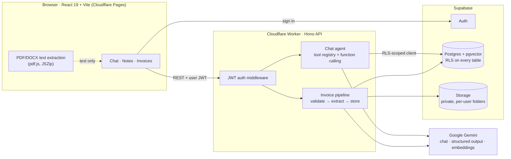

<p align="center">
  
</p>

<h1 align="center">AI Notatnik</h1>

<p align="center">
  <b>An AI assistant for notes, invoices and documents — built for Polish freelancers and small businesses.</b><br/>
  Chat with your notes, upload invoices and get your tax-deductible costs (KUP) calculated, or ask questions about any PDF without storing it.
</p>

<p align="center">
  🌐 <a href="https://ai-notatnik.pages.dev"><b>ai-notatnik.pages.dev</b></a> ·
  <a href="docs/Instrukcja-AI-Notatnik.pdf">User guide (PL, PDF)</a> ·
  <a href="README.pl.md">🇵🇱 Polska wersja</a>
</p>

<p align="center">
  
  
  
  
  
  
  
  
</p>

> [!TIP]
> **Try the app live: [https://ai-notatnik.pages.dev](https://ai-notatnik.pages.dev)**
>
> Runs in the browser — no installation. Create an account with your e-mail (**Rejestracja**), confirm it, and you can chat, add notes and upload invoices. The interface is in Polish.

---

## Table of contents

- [What it does](#what-it-does)
- [Architecture](#architecture)
- [Tech stack](#tech-stack)
- [Engineering highlights](#engineering-highlights)
- [Security & privacy](#security--privacy)
- [Project structure](#project-structure)
- [Running locally](#running-locally)
- [Deployment](#deployment)
- [API](#api)
- [Limitations & roadmap](#limitations--roadmap)

---

## What it does

The UI is in Polish and has three tabs: **Czat** (chat), **Notatki** (notes) and **Faktury** (invoices).

### 💬 AI chat that can act
- The assistant uses **function calling** to search notes, find invoices, calculate costs or look up legal articles — it decides which tool to use.
- Say *"Zapisz notatkę…"* (save a note) and it is created, embedded and shown in the Notes tab.
- Replies render as **Markdown** (tables, lists, code).
- Say hello and it explains what it can and cannot do.

### 📝 Notes
- Card list with search, Markdown preview, create / edit / delete in the tab or from the chat.
- **Semantic search** with Gemini embeddings + pgvector, plus exact keyword search.

### 🧾 Invoices & tax-deductible costs (KUP)
- **Bulk upload** (e.g. 50 invoices at once) with a progress bar, auto-refreshing statuses and **automatic retries**.
- AI extracts invoice number, seller, date, net / VAT / gross amounts and category.
- **Non-invoices are rejected** (contracts, CVs, random or explicit content, prompt-injection attempts) and the stored file is deleted.
- **KUP calculated in SQL, not by the LLM** — net amounts for VAT payers, gross for non-VAT payers (Polish PIT art. 23 ust. 1 pkt 43), with a per-user setting.
- Exclude private expenses from the chat (*"exclude the Media Expert invoice from Sept 22"*) — with confirmation.
- Open (signed URL), select, bulk-delete and re-process files.

### 📎 Ask about local documents — without uploading
- Attach **one or up to 100 files** (PDF / DOCX / TXT / MD). Text is extracted **in the browser**; the file never leaves the computer.
- Answers are **strictly scoped to the attached documents**: attach the Tax Ordinance and ask about the Criminal Code → the assistant declines.
- Works for batches: *"sum net and gross of these 30 invoices in a table"*.

### ⚖️ Legal article lookup
- Describe a problem; the assistant finds relevant articles from legal acts ingested into the vector store.

---

## Architecture



Every API request carries the **user's own JWT**, and the Worker creates a Supabase client with it — so **Postgres Row Level Security** decides what each query can see. There is no service-role key in the deployed app.

---

## Tech stack

| Layer | Technology |
|---|---|
| Frontend | React 19, TypeScript, Vite, react-markdown + remark-gfm, pdf.js (unpdf), JSZip |
| API | Cloudflare Workers, Hono, Zod |
| AI | Google Gemini (`gemini-3-flash-preview` with fallback to `gemini-3.1-flash-lite`), `gemini-embedding-001` (768-dim) |
| Data | Supabase: PostgreSQL, pgvector, Row Level Security, Auth, Storage |
| Hosting | Cloudflare Pages (frontend) + Cloudflare Workers (API) |
| Extras | MCP server (Model Context Protocol) for Claude Desktop, CLI chat |

---

## Engineering highlights

Problems I ran into while building and deploying this, and how I solved them:

| Problem | Solution |
|---|---|
| **Parsing PDFs on the Worker exceeded the 10 ms CPU limit** (`exceededCpu`), so uploads failed with "Failed to fetch". | Moved text extraction to the **browser** (lazy-loaded pdf.js). The Worker only receives text; its bundle shrank from ~3.4 MB to ~0.8 MB, and attached files never leave the user's machine. |
| **LLMs are unreliable at arithmetic** — and these are tax numbers. | The model only picks the date range; **totals are computed deterministically** from SQL rows. A disclaimer is enforced in code if the model forgets it. |
| **The Gemini model was retired** for new API keys (404), then free-tier quotas (429) and overload (503). | `withModelFallback`: one retry on 429/503, then a fallback model. Users see a generic message, never raw API errors or model names. |
| **Bulk uploads hit rate limits.** | Upload pool (2 concurrent), auto-refresh, **automatic retries** (3× with backoff), idempotent `reprocess` endpoint that deletes the previous result first so KUP is never double-counted. |
| **Answers about an attached document drifted into general knowledge.** | Scope enforced **in code, not only in the prompt**: document-scoped turns get **no tools**, so the model can't pull other acts, notes or invoices. |
| **Anyone could upload anything as an "invoice".** | Invoice validation happens in the **same structured-output call** as extraction (no extra cost) and treats the document as untrusted data. Verified on a real invoice, a lease, a CV, adult content, a prompt-injection attempt and an amount-less invoice: 6/6 correct. |
| **Retired tool-call roles** — newer Gemini models reject the old SDK's `function` role. | Chose models compatible with the current SDK; migration to `@google/genai` is on the roadmap. |

---

## Security & privacy

- **Row Level Security on all 10 tables** and on Storage; RPC search functions are `SECURITY INVOKER`, so they can't bypass it.
- **Per-user storage folders** (`uploads/<user_id>/…`), files opened via **60-second signed URLs**.
- **CORS allowlist** with wildcard support for preview deployments; no `*` in production.
- **No raw HTML** is rendered from Markdown — model output and document text can't inject markup (tested with `<script>` / `onerror`).
- **Prompt-injection hardening**: document content is wrapped in tags and treated as data; the assistant refuses to reveal other users' data or its instructions.
- Secrets live in Wrangler secrets / git-ignored files; the Cloudflare `account_id` is pinned so deploys can't land on the wrong account.

---

## Project structure

```
├── frontend/                 React app (Cloudflare Pages)
│   └── src/
│       ├── pages/            ChatPage, NotesPage, FilesPage, AuthPage
│       ├── components/       Markdown renderer
│       └── lib/              API client, in-browser text extraction
├── worker/                   Cloudflare Worker (Hono API)
│   ├── routes/               notes, chat (conversations), files, profile
│   ├── tools/                AI tools: semantic/keyword search, find/exclude invoices,
│   │                         KUP summary, legal search + registry
│   ├── lib/                  Gemini client & fallback, invoice pipeline
│   └── middleware/auth.ts    JWT → RLS-scoped Supabase client
├── ai/prompts.ts             System prompt (shared with the MCP server)
├── supabase/migrations/      schema.sql + numbered migrations (0002–0007)
├── mcp/                      MCP server for Claude Desktop
├── scripts/                  Embedding backfill, legal act ingestion
└── docs/                     User guide (PDF + HTML source)
```

---

## Running locally

**Prerequisites:** Node.js 18+, a [Supabase](https://supabase.com) project, a [Google AI Studio](https://aistudio.google.com/app/apikey) API key.

**1. Install**
```bash
npm install
cd frontend && npm install && cd ..
```

**2. Database** — in the Supabase SQL editor run, in order:
`supabase/migrations/schema.sql`, then `0002_…` through `0007_…`.

**3. Environment**
```bash
cp .dev.vars.example .dev.vars              # Worker: SUPABASE_URL, SUPABASE_ANON_KEY, GEMINI_API_KEY
cp frontend/.env.example frontend/.env      # Frontend: VITE_SUPABASE_URL, VITE_SUPABASE_ANON_KEY, VITE_API_URL
```

**4. Run** (two terminals)
```bash
npm run dev:worker          # API on http://localhost:8787
cd frontend && npm run dev  # App on http://localhost:5173
```

**Optional — local admin tools**
```bash
npm run ingest-legal-act -- <file.txt> "<act name>" <YYYY-MM-DD>   # add a legal act to the vector store
npm run mcp                                                        # MCP server for Claude Desktop
```
These run with `SUPABASE_URL`, `SUPABASE_SERVICE_ROLE_KEY` and `GEMINI_API_KEY` from the root `.env`. The service-role key bypasses RLS, so it stays local and is never deployed.

---

## Deployment

```bash
npx wrangler secret put SUPABASE_URL        # once; also SUPABASE_ANON_KEY, GEMINI_API_KEY
npm run deploy                              # Worker + frontend in one step
```

`npm run deploy` deploys the Worker, builds the frontend with `frontend/.env.production` and publishes it to Cloudflare Pages. A `CLOUDFLARE_API_TOKEN` in the git-ignored root `.env` is used for authentication.

---

## API

All routes except `/health` require `Authorization: Bearer <Supabase JWT>`.

| Method & path | Purpose |
|---|---|
| `GET /notes` · `GET /notes/search?q=` · `POST /notes/semantic-search` | List, keyword search, vector search |
| `POST /notes` · `PATCH /notes/:id` · `DELETE /notes/:id` | Create / edit (re-embeds) / delete |
| `POST /conversations` · `GET /conversations` · `DELETE /conversations/:id` | Conversations |
| `GET /conversations/:id/messages` · `POST /conversations/:id/messages` | History · send a message (optional `attachments[]`) |
| `GET /files` · `POST /files` | List · upload (multipart: file + extracted text) |
| `GET /files/:id/url` · `POST /files/:id/reprocess` · `DELETE /files/:id` | Signed URL · retry AI step · delete with its invoice |
| `GET /profile` · `PUT /profile` | VAT status (`vat_payer`) → KUP basis |

---

## Limitations & roadmap

- **No automated tests yet** — features were verified with scripted checks against the live model and the database. Adding Vitest for tools/routes is the next step.
- KUP doesn't model **partial VAT deduction** (e.g. 50% on passenger cars) or other category limits — results are marked as a bookkeeping aid.
- Scanned PDFs without a text layer aren't supported (no OCR yet).
- The legal article store is empty until acts are ingested with `npm run ingest-legal-act`.
- Planned: migrate to the `@google/genai` SDK, OCR for scans, CSV/Excel export of invoices, KSeF integration.

---

<p align="center">
  Built by <a href="https://github.com/PrzybycinPortfolio">PrzybycinPortfolio</a>
</p>
