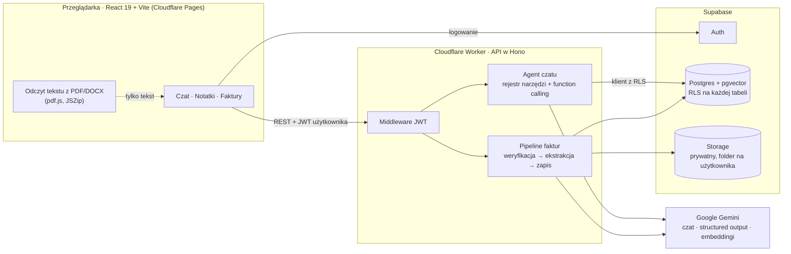

<p align="center">
  
</p>

<h1 align="center">AI Notatnik</h1>

<p align="center">
  <b>Asystent AI do notatek, faktur i dokumentów — dla freelancerów i małych firm.</b><br/>
  Rozmawiaj ze swoimi notatkami, wgraj faktury i policz koszty uzyskania przychodu (KUP) albo zadaj pytanie o dowolny PDF bez zapisywania go.
</p>

<p align="center">
  <a href="https://ai-notatnik.pages.dev"><b>Wersja demo →</b></a> ·
  <a href="docs/Instrukcja-AI-Notatnik.pdf">Instrukcja użytkownika (PDF)</a> ·
  <a href="README.md">🇬🇧 English version</a>
</p>

<p align="center">
  
  
  
  
  
  
  
  
</p>

---

## Spis treści

- [Co potrafi](#co-potrafi)
- [Architektura](#architektura)
- [Technologie](#technologie)
- [Najciekawsze problemy techniczne](#najciekawsze-problemy-techniczne)
- [Bezpieczeństwo i prywatność](#bezpieczeństwo-i-prywatność)
- [Struktura projektu](#struktura-projektu)
- [Uruchomienie lokalne](#uruchomienie-lokalne)
- [Wdrożenie](#wdrożenie)
- [API](#api)
- [Ograniczenia i plany](#ograniczenia-i-plany)

---

## Co potrafi

Aplikacja ma trzy zakładki: **Czat**, **Notatki** i **Faktury**.

### 💬 Czat z AI, który działa, a nie tylko odpowiada
- Asystent korzysta z **function calling**: sam decyduje, czy przeszukać notatki, znaleźć faktury, policzyć koszty czy wyszukać przepisy.
- „Zapisz notatkę…” — notatka powstaje, dostaje embedding i pojawia się w zakładce Notatki.
- Odpowiedzi renderowane jako **Markdown** (tabele, listy, kod).
- Na „cześć” asystent mówi, co potrafi, a czego nie.

### 📝 Notatki
- Lista kart z wyszukiwarką, podgląd w Markdown, tworzenie / edycja / usuwanie w zakładce albo z czatu.
- **Wyszukiwanie semantyczne** (embeddingi Gemini + pgvector) oraz po słowach.

### 🧾 Faktury i koszty uzyskania przychodu (KUP)
- **Wgrywanie wielu plików naraz** (np. 50 faktur) z paskiem postępu, odświeżaniem statusów i **automatycznym ponawianiem**.
- AI odczytuje numer, sprzedawcę, datę, kwoty netto / VAT / brutto i kategorię.
- **Pliki, które nie są fakturą, są odrzucane** (umowy, CV, treści przypadkowe lub nieodpowiednie, próby prompt injection), a ich kopia usuwana.
- **KUP liczony w SQL, a nie przez model** — z kwot netto dla czynnych podatników VAT, z brutto dla niewatowców (art. 23 ust. 1 pkt 43 ustawy o PIT), według ustawienia użytkownika.
- Wykluczanie prywatnych wydatków z czatu („wyklucz fakturę z Media Expert z 22 września”) — z potwierdzeniem.
- Podgląd (podpisany link), zaznaczanie, usuwanie zbiorcze i ponowne przetwarzanie.

### 📎 Pytania o dokumenty z komputera — bez wgrywania
- Dołącz **od 1 do 100 plików** (PDF / DOCX / TXT / MD). Tekst wyciąga **przeglądarka** — plik nie opuszcza komputera.
- Odpowiedzi są **ściśle ograniczone do dołączonych dokumentów**: dołączysz Ordynację podatkową i zapytasz o Kodeks karny → asystent odmówi.
- Działa na paczkach: „zsumuj netto i brutto tych 30 faktur w tabeli”.

### ⚖️ Wyszukiwanie przepisów
- Opisz problem, a asystent znajdzie pasujące artykuły z aktów prawnych wczytanych do bazy wektorowej.

---

## Architektura



Każde zapytanie do API niesie **JWT zalogowanego użytkownika**, a Worker tworzy z nim klienta Supabase — o tym, co widzi zapytanie, decyduje **Row Level Security w Postgresie**. Wdrożona aplikacja nie używa klucza `service_role`.

---

## Technologie

| Warstwa | Technologia |
|---|---|
| Frontend | React 19, TypeScript, Vite, react-markdown + remark-gfm, pdf.js (unpdf), JSZip |
| API | Cloudflare Workers, Hono, Zod |
| AI | Google Gemini (`gemini-3-flash-preview`, zapasowo `gemini-3.1-flash-lite`), `gemini-embedding-001` (768 wymiarów) |
| Dane | Supabase: PostgreSQL, pgvector, Row Level Security, Auth, Storage |
| Hosting | Cloudflare Pages (frontend) + Cloudflare Workers (API) |
| Dodatki | Serwer MCP (Model Context Protocol) dla Claude Desktop, czat w CLI |

---

## Najciekawsze problemy techniczne

Na co trafiłem przy budowie i wdrożeniu — i jak to rozwiązałem:

| Problem | Rozwiązanie |
|---|---|
| **Parsowanie PDF w Workerze przekraczało limit 10 ms CPU** (`exceededCpu`) — upload kończył się „Failed to fetch”. | Odczyt tekstu przeniesiony do **przeglądarki** (pdf.js ładowany na żądanie). Worker dostaje tylko tekst, jego paczka zmalała z ~3,4 MB do ~0,8 MB, a dołączane pliki nie opuszczają komputera. |
| **Modele językowe mylą się w rachunkach** — a to są liczby podatkowe. | Model wybiera tylko zakres dat; **sumy liczone są deterministycznie** z wierszy SQL. Zastrzeżenie o weryfikacji z księgowym jest wymuszane w kodzie. |
| **Model Gemini wycofany** dla nowych kluczy (404), potem limity darmowego planu (429) i przeciążenia (503). | `withModelFallback`: jedno ponowienie przy 429/503, potem model zapasowy. Użytkownik widzi ogólny komunikat, nigdy surowy błąd API ani nazwę modelu. |
| **Masowy upload trafiał w limity zapytań.** | Pula uploadu (2 równolegle), auto-odświeżanie, **automatyczne ponawianie** (3× z rosnącą przerwą), idempotentny endpoint `reprocess`, który najpierw usuwa poprzedni wynik — KUP nigdy nie liczy się podwójnie. |
| **Odpowiedzi o dołączonym dokumencie uciekały w wiedzę ogólną.** | Zakres wymuszony **w kodzie, nie tylko w prompcie**: przy załączniku model nie dostaje **żadnych narzędzi**, więc nie sięgnie do innych ustaw, notatek ani faktur. |
| **Jako „fakturę” można było wgrać cokolwiek.** | Weryfikacja odbywa się w **tym samym wywołaniu structured output** co ekstrakcja (bez dodatkowego kosztu), a treść dokumentu traktowana jest jako niezaufane dane. Test: faktura, umowa, CV, treść 18+, próba prompt injection, faktura bez kwot — 6/6 poprawnie. |
| **Nowsze modele Gemini odrzucają rolę `function`** używaną przez stare SDK. | Dobór modeli zgodnych z obecnym SDK; migracja do `@google/genai` jest w planach. |

---

## Bezpieczeństwo i prywatność

- **Row Level Security na wszystkich 10 tabelach** i w Storage; funkcje wyszukiwania RPC działają jako `SECURITY INVOKER`, więc go nie omijają.
- **Osobny folder na pliki każdego użytkownika** (`uploads/<user_id>/…`), pliki otwierane przez **podpisane linki ważne 60 s**.
- **Lista dozwolonych domen CORS** z obsługą wildcardów dla wdrożeń podglądowych; w produkcji bez `*`.
- Markdown **nie renderuje surowego HTML** — ani odpowiedź modelu, ani treść dokumentu nie wstrzyknie kodu (sprawdzone na `<script>` / `onerror`).
- **Ochrona przed prompt injection**: treść dokumentów jest opakowana w tagi i traktowana jako dane; asystent odmawia ujawnienia danych innych użytkowników i swoich instrukcji.
- Sekrety w Wrangler secrets i plikach ignorowanych przez git; `account_id` Cloudflare przypięty na stałe, więc wdrożenie nie trafi na inne konto.

---

## Struktura projektu

```
├── frontend/                 Aplikacja React (Cloudflare Pages)
│   └── src/
│       ├── pages/            ChatPage, NotesPage, FilesPage, AuthPage
│       ├── components/       Renderer Markdown
│       └── lib/              Klient API, odczyt tekstu w przeglądarce
├── worker/                   Cloudflare Worker (API w Hono)
│   ├── routes/               notes, chat (rozmowy), files, profile
│   ├── tools/                Narzędzia AI: wyszukiwanie semantyczne/po słowach,
│   │                         szukanie/wykluczanie faktur, KUP, przepisy + rejestr
│   ├── lib/                  Klient Gemini z fallbackiem, pipeline faktur
│   └── middleware/auth.ts    JWT → klient Supabase z RLS
├── ai/prompts.ts             Prompt systemowy (wspólny z serwerem MCP)
├── supabase/migrations/      schema.sql + numerowane migracje (0002–0007)
├── mcp/                      Serwer MCP dla Claude Desktop
├── scripts/                  Uzupełnianie embeddingów, wczytywanie ustaw
└── docs/                     Instrukcja użytkownika (PDF + źródło HTML)
```

---

## Uruchomienie lokalne

**Wymagania:** Node.js 18+, projekt [Supabase](https://supabase.com), klucz API z [Google AI Studio](https://aistudio.google.com/app/apikey).

**1. Instalacja**
```bash
npm install
cd frontend && npm install && cd ..
```

**2. Baza danych** — w edytorze SQL Supabase uruchom kolejno:
`supabase/migrations/schema.sql`, a potem `0002_…` do `0007_…`.

**3. Zmienne środowiskowe**
```bash
cp .dev.vars.example .dev.vars              # Worker: SUPABASE_URL, SUPABASE_ANON_KEY, GEMINI_API_KEY
cp frontend/.env.example frontend/.env      # Frontend: VITE_SUPABASE_URL, VITE_SUPABASE_ANON_KEY, VITE_API_URL
```

**4. Start** (dwa terminale)
```bash
npm run dev:worker          # API na http://localhost:8787
cd frontend && npm run dev  # Aplikacja na http://localhost:5173
```

**Opcjonalnie — lokalne narzędzia administracyjne**
```bash
npm run ingest-legal-act -- <plik.txt> "<nazwa aktu>" <RRRR-MM-DD>   # dodaje ustawę do bazy wektorowej
npm run mcp                                                          # serwer MCP dla Claude Desktop
```
Korzystają z `SUPABASE_URL`, `SUPABASE_SERVICE_ROLE_KEY` i `GEMINI_API_KEY` z głównego `.env`. Klucz `service_role` omija RLS, dlatego zostaje lokalnie i nigdy nie jest wdrażany.

---

## Wdrożenie

```bash
npx wrangler secret put SUPABASE_URL        # jednorazowo; również SUPABASE_ANON_KEY, GEMINI_API_KEY
npm run deploy                              # Worker + frontend jedną komendą
```

`npm run deploy` wdraża Workera, buduje frontend z `frontend/.env.production` i publikuje go na Cloudflare Pages. Do uwierzytelnienia służy `CLOUDFLARE_API_TOKEN` w ignorowanym przez git pliku `.env`.

---

## API

Wszystkie ścieżki poza `/health` wymagają nagłówka `Authorization: Bearer <JWT z Supabase>`.

| Metoda i ścieżka | Do czego służy |
|---|---|
| `GET /notes` · `GET /notes/search?q=` · `POST /notes/semantic-search` | Lista, wyszukiwanie po słowach, wyszukiwanie wektorowe |
| `POST /notes` · `PATCH /notes/:id` · `DELETE /notes/:id` | Tworzenie / edycja (z nowym embeddingiem) / usuwanie |
| `POST /conversations` · `GET /conversations` · `DELETE /conversations/:id` | Rozmowy |
| `GET /conversations/:id/messages` · `POST /conversations/:id/messages` | Historia · wysłanie wiadomości (opcjonalnie `attachments[]`) |
| `GET /files` · `POST /files` | Lista · upload (multipart: plik + odczytany tekst) |
| `GET /files/:id/url` · `POST /files/:id/reprocess` · `DELETE /files/:id` | Podpisany link · ponowienie kroku AI · usunięcie z fakturą |
| `GET /profile` · `PUT /profile` | Status VAT (`vat_payer`) → podstawa KUP |

---

## Ograniczenia i plany

- **Brak testów automatycznych** — funkcje były sprawdzane skryptami na prawdziwym modelu i bazie. Kolejny krok: testy Vitest dla narzędzi i endpointów.
- KUP nie uwzględnia **częściowego odliczenia VAT** (np. 50% przy samochodach osobowych) ani innych limitów kosztów — wynik oznaczony jest jako pomoc księgowa.
- Brak obsługi skanów PDF bez warstwy tekstowej (brak OCR).
- Baza przepisów jest pusta, dopóki nie wczyta się ustaw przez `npm run ingest-legal-act`.
- W planach: migracja na SDK `@google/genai`, OCR skanów, eksport faktur do CSV/Excel, integracja z KSeF.

---

<p align="center">
  Autor: <a href="https://github.com/PrzybycinPortfolio">PrzybycinPortfolio</a>
</p>
